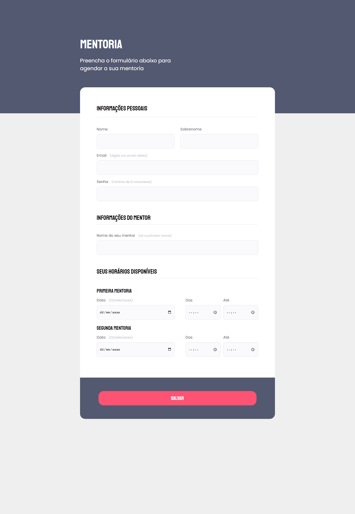

# Desafio 03 - stage 03, modulo 01 - Formação Explore Rocketseat

No modulo 01 da stage 03, estamos estudando formulários e esse foi o desafio a ser feito para por os conhecimnetos adquiridos em prática.

## 🧰 Stack utilizada

**Front-end:** HTML, CSS

**Design:** Figma

**Fontes:** Google fonts

## 🚀 Sobre mim

Eu sou uma desenvolvedor full-stack em Javascript, Node, React, SQLite.

Confira mais projetos nos meus repositórios github.🗃️

## 🔗 Links

## 🎨 Demonstração

